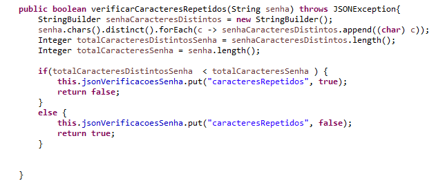
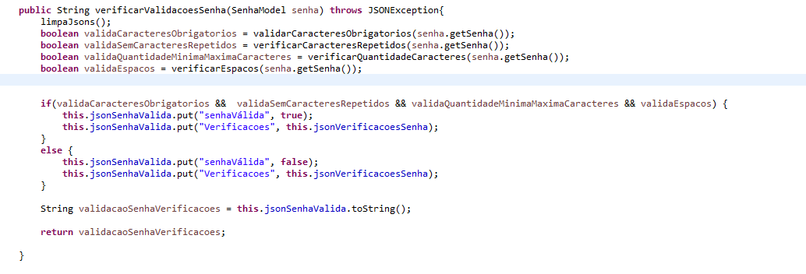

<h1 align="center">Documentação da solução</h1>
    

            
            
            
    

    <h2 align="center" > Gerando projeto e modelagem</h2>
    <h5>O primeiro passo foi criar o projeto atrávés do spring.io com as dependencias necessárias, como demonstra a imagem:</h5>
    

        
    

    <h5>Com o projeto baixado e configurado, comecei a modelar a API seguindo a arquitetura "Package by Layer":</h5>
    <h5>    
        <ul>
            <li>Camada de interface (web — controllers e views no Spring MVC) </li>
            <li>Camada lógica de negócio (service — models, domains e services no Spring MVC)</li>
            <li>Camada de persistência (data — repository no Spring Data)(que não foi necessária para o projeto em questão)</li>
            <li>Com a adição do package "Config", para a criação e utilização do Swagger(Documentacao da api)</li>
        </ul>
    </h5>
    <h5>
    No package "Model", foi criado o model "SenhaModel" com seus respectivos métodos getter e setter, e o construtor
    A criação da camada de Model é importante, pois, obriga um padrão que posteriomente TEM que ser seguido pelo  controller(controladores) e service(serviços)
    </h5>
    <h5>
    No package "Controller" foi criado o controller "ValidaSenhaController", que servirá para a criação das rotas com seus respectivos métodos(get,post,put,delete....)
    Nesse projeto  foi criado a seguinte rota:
    /valida-senha/senha/{senhaUsuario}
    No qual a {senhaUsuario} é um parametro e seu request.Method é um get. que retornará um json com os dados de validacao da senha que foram produzidos pela camada de negócio services.
    </h5>
    <h5>
    No package "Services" foi criado o Service "ValidaSenhaService" em que está embutida toda a lógica da validação de senha que posteriormente será explicada com mais detalhes.
    O Services é fundamental, para que a lógica de negócio do projeto seja cumprida.
    </h5>
    <h5>
    Por último o package "Config", que terá a classe SwaggerConfig, que servirá, exclusivamente, para a criação do swagger que é a documentação da API. 
    </h5>
    

        
    

    <h2 align="center">Lógica da solução</h5>
    <h3>ValidaSenhaService</h3>
    <h5>É no Service "ValidaSenhaService" onde está embutido a lógica para a resolução do problema em questão:
    Verificar se uma senha é válida ou não, de acordo com as seguintes validações:
    </h5>
    <h5>
        <ul>
            <li>Nove ou mais caracteres</li>
            <li>Ao menos 1 dígito</li>
            <li>Ao menos 1 letra minúsclia</li>
            <li>Ao menos 1 letra maiusclia</li>
            <li>Ao menos 1 caractere Especial(!@#$%^&*()-+)</li>
            <li>Não possuir caracteres repetidos dentro do conjunto</li>
        </ul>
    </h5>
    <h5>Primeiro, foi criado três objetos, Pattern, jsonSenhaVálida e jsonVerificacoesSenha</h5>
    <h5>Pattern do tipo pattern, é necessário para fazer as validações com Regex</h5>
    <h5>jsonSenhaVálida e jsonVerificacoesSenha são dois objetos do tipo Json, que vão servir, respectivamente, para receber se a senha é válida ou não e as verificações que foram feitas.</h5>
    

        
    

    <h5>Na primeira função do tipo boolean: validarCaracteresObrigatorios, argumento: String Senha</h5>
    

        
    

    <h5> Tem-se a criação de uma List do tipo String que receberá os caracteres obrigatórios que faltaram na senha, o Map "mapRegex" em que chave terá o Nome da validação regex e em sua chave o próprio regex
    em seguida a criação de um loop, que passará por cada um dos valores dentro do mapRegex, e compilará o valor no pattern que posteriomente será passado pra váriavel "Matcher"
    que por sua vez, terá o método find() que procurará o caractere definido no regex  no argumento da função, que nesse caso, é a Senha.
    Após terminada a verificação com regex, inserirá os caracteres que faltaram com a chave "CaracteresFaltantes" no jsonVerificacoesSenha,
    Se tiver todos os caracteres obrigatórios, insirirá "nenhum" no lugar dos caracteres.
    Por último, retornará True se não faltar nenhum caractere, e False caso contrário.
    </h5>    
    <h5>Na segunda função do tipo boolean: verificarEspacos, argumento: String Senha </h5>
    

        
    

    <h5> Mesmo que não estivesse na especificações, eu senti que seria necessário essa validação de espaços em brancos, uma vez que, uma senha não deveria ter espaços em branco</h5>
    <h5>Nessa função, eu ultilizo o Regex "\s" para verificar se há espaços em branco no argumento passado para a função, se houver adicionará "espaçoEmBranco":"True"
    no jsonVerificacoesSenha, caso contrário, "espaçoEmBranco":"false".
    No retorno, se houve espaços em branco retornará false, se não, retornará True.
    </h5>
    <h5>Na terceira função do tipo boolean: verificarCaracteresRepetidos, argumento: String Senha </h5>
    

        
    

    <h5>Tem-se a verificação de caracteres repetidos no argumento da funcao, percorrendo cada elemento da deste para verificar se há caracteres repetidos, em  uma Variavel que receberá essa mesma String sem nenhum caracter repetido, 
    por último, verifica o tamanho da String original com a String mudada para verificar se houve ou não caracteres repetidos.
    Se não houver caracteres repetidos o jsonVerificacoesSenha receberá caracteresRepetidos: "true", caso contrário, caracteresRepetidos: "false"
    Por último retorna True se não houve caracteres repetidos e False se houve caracteres repetidos.
    </h5>
    <h5> Na quarta função do tipo boolean: verificarQuantidadeCaracteres, argumento: String Senha</h5>
    

        
    

    <h5>
    É pego o lenght()(tamanho do array) do argumento da função(senha) e verifica se ele segue o padrão de 9 caracteres minimos e 30 caracteres máximo.
    Se o argumento passado para a  função tiver menos que 9 caracteres, o jsonVerificacoesSenha receberá na chave quantidadeDeCaracteresQueFaltam:(a quantidade de caracteres que faltam para dar 9 caracteres)
    Se o argumento passado para a função tiver mais que 30 caracteres, o jsonVerificacoesSenha receberá na chave quantidadeDeCaracteresQueDevemSerRetirados:(a quantidade de caracteres a serem retirados para ser menor que 30 caracteres)
    Por último, Retorna true se  a String estiver dentro dessa intersecção(9 e 30) e False se a String não estiver. 
    </h5>
    <h5>Na quinta função void: limpaJsons</h5>
    

        
    

    <h5> Tem-se a função de limpar os jsons com a instanciação deles novamente</h5>
    <h5>Na sexta e ultima função do tipo String verificarValidacoesSenha, argumento: SenhaModel senha</h5>
    

        
    

    <h5> É chamada a função limpaJsons() para que não haja acúmulo de dados nos jsons que serão retornados</h5>
    <h5>Tem-se então a criação de 5 váriaveis do tipo boolean  que vão receber o retorno da  chamada de cada uma das funções supracitadas passando-se como argumento o senha.getSenha() que retornará a senha passada pelo usuário na Api</h5>
    <h5>É realizado um if que verificará se todas as váriaveis receberam como valor "True"</h5>
    <h5> Se todas forem "True" será inserido no jsonSenhaValida, "senhaVálida":"True" e  "Verificacoes": jsonVerificacoesSenha </h5>
    <h5>Caso contrário, será inserido no jsonSenhaValida, "senhaVálida":"False" e  "Verificacoes": jsonVerificacoesSenha </h5>
    <h5>Por último retorna jsonSenhaValida em formato de String</h5>
    <h3>ValidaSenhaController</h3>
    

        
    

    <h5> No Controller "ValidaSenhaController" tem se a injeção de dependencia do ValidaSenhaService. Logo após, foi alterado a mensagem retornada para o código 200(sucess) e 500(internal server erro)
    que foram mudadas respectivamente para: Retornado a validação da senha e suas verificações e Foi gerada uma exceção". Então é criado a nossa rota "/valida-senha/senha/{senhaUsuario}" 
    em que a sua requisição é do método "GET" e que retornará um json, sendo o {senhaUsuario}, um argumento passado para a rota que sera inserida em uma váriavel na função validaSenha do tipo ResponseEntity
    Na função validaSenha: É instanciado a váriavel 'senha' do tipo SenhaModel, e então é setado nessa váriavel a senha do usuário que foi passada na rota e colocada na váriavel senhaUsuário.
    No bloco try-catch é criado a váriavel do tipo String "senhaValidadaVerificacoes" que receberá o retorno da função  da verificarValidacoesSenha do ValidaSenhaService, passando como argumento a variavel "senha"
    E então retornará ResponseEntity.ok com a senhaValidadaVerificacoes passada como argumento.
    Caso haja alguma exceção é retornado um ResponseEntity com a mensagem de "Erro de parametro: Parametro não reconhecido"
    </h5>
    <h3>SenhaModel</h3>
    

        
    

    <h5>
        O Model senhaModel, foi criado com o intuito de fixar e encapsular os atributos necessários para a resolução da questão.
        Nesse caso, foi criado atributo do senha do  tipo String junto com seus métodos get e set, e os construtores.
    </h5>
    <h3>Resumo</h3>
    <h4>
        Em suma, para esse problema eu utilizo regex para válidar se tem todos os caracteres necessários e tambem para validar se há caracteres que não devem estar na senha
        como o espaço em branco,eu valido seu tamanho com o método lenght() e verifico se ele está no range de 9 a 30 caracteres, verifico se há caracteres repetidos atrávés de um foreach
        em chars distintos e retorno se a senha é valida ou não, junto com essas verificaçõe em um formato de json. 
    </h4>
    <h2 align="center">Prática(Verificando o funcionamento)</h2>
    <h5> Com o uso do Swagger criado, foi feito o mesmo teste mostrado na apresentação do problema. Usando as seguintes senhas como teste:</h5>
    <ul>
        <li>""</li>
        <li>"aa"</li>
        <li>"AAAbbbCc"</li>
        <li>"AbTp9!foo"</li>
        <li>"AbTp9!foA"</li>
        <li>"AbTp9 fok"</li>
        <li>"AbTp9!fok"</li>
    </ul>
    <h5>Testes:</h5>
    

        
    

    

        
    

    

        
    

    

        
    

    

        
    

    

        
    

    

        
    

    <h2 align="center">Testes(Integração e Unitário)</h2>
    <h3>Teste unitário</h3>
    

        
    

    <h5> 
        No teste unitário, primeiro eu fiz a injenção de depedencia do Service ValidaSenhaService.
        Criei a função do tipo void verificaRetornoNullAutenticacaoSenhaService, para verificar se o retorno não é nulo.
        Na segunfa função senhaVerificadaComSucesso, eu crio uma senha teste faço o set no meu objeto instanciado senha e passo como argumento
        em cada uma das funções utilizadas no  ValidaSenhaService no AssertNotNull, que verificará se as váriaveis passadas como argumento não são null.
        Juntamente com a senha teste que foi passada pro set, é igual a senha.getSenha().
    </h5>
    <h5>Teste unitário na prática:</h5>
    

        
    

    <h3>Teste Integração</h3>
    

        
    

    <h5>
        No teste de integração foi criado a função base contextLoad() que verifica se há algo nulo no mockMVC.
        Ademais, foi criado a função verificarRetornoApiSenha, que tem uma rota fixa com uma senha teste que verifica se o retorno da rota é o status 200, "ok"
    </h5>
    <h5>Teste de integração na prática:</h5>
    

        
    

